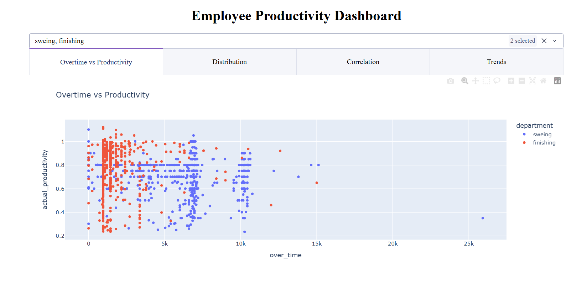
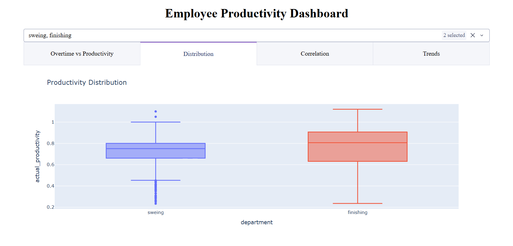
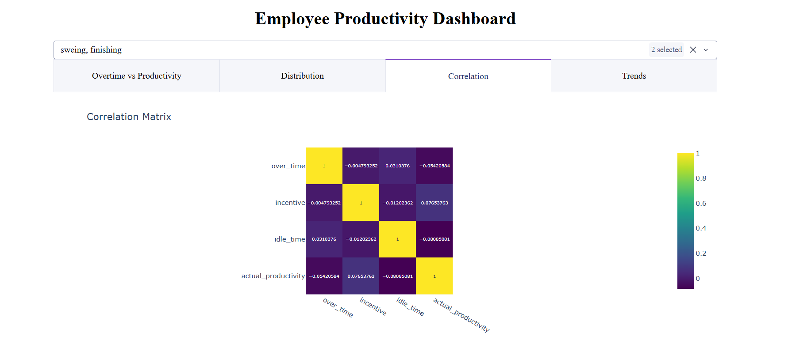
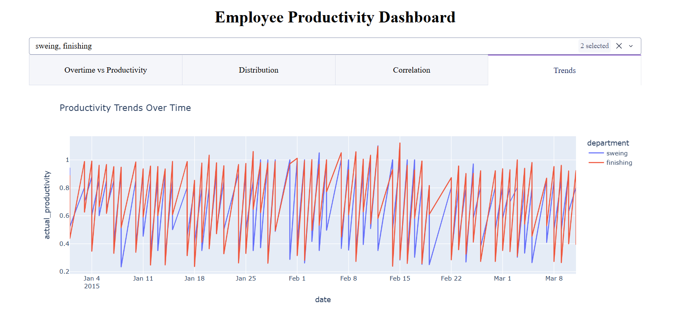

# Employee Productivity Dashboard

An interactive dashboard built using Python and Dash to analyze employee productivity across departments. The dashboard provides multiple visualizations that help explore how overtime, incentives, idle time, and time-based trends relate to actual productivity.

This project focuses on creating an intuitive, interactive interface for productivity analysis rather than static charts.

---

## Project Overview

The Employee Productivity Dashboard allows users to dynamically filter data by department and view productivity metrics from multiple perspectives. Each visualization highlights a different aspect of employee performance, making it easier to identify trends, patterns, and potential areas for improvement.

The application is designed to run locally using Dash, which is the recommended and officially supported environment for Dash applications.

---

## Features

- Interactive department-level filtering using a dropdown
- Scatter plot showing the relationship between overtime and productivity
- Box plot comparing productivity distributions across departments
- Correlation matrix of key productivity-related variables
- Line chart visualizing productivity trends over time
- Tab-based layout for clear and organized navigation

---

## Dashboard Preview

Screenshots of the dashboard are included below.  
All images are stored in the `screenshots/` folder in this repository.

### Overtime vs Productivity


### Productivity Distribution by Department


### Correlation Matrix


### Productivity Trends Over Time


---

## Technologies Used

- Python  
- Dash  
- Plotly Express  
- Pandas  

---


## Project Structure

employee-productivity-dashboard/
│

├── app.py
├── requirements.txt 
├── README.md
├── .gitignore
└── analysis.ipynb


---

## How to Run the Application

### 1. Clone the repository

```bash
git clone https://github.com/YOUR-USERNAME/employee-productivity-dashboard.git
cd employee-productivity-dashboard

### 2. Install dependencies

pip install -r requirements.txt


### 3. Run the dashboard

python app.py


### 4. View the dashboard

http://127.0.0.1:8050
```

## Features
The data is loaded from a publicly available Google Sheets CSV export. The dataset includes information such as:
- Date
- Department
- Team
- Overtime hours
- Incentives
- Idle time
- Actual productivity
No local data files are required to run the application.

---


## Notes on Environment
Initial development and testing were performed using Jupyter Notebook. The final dashboard is provided as a standalone Python script (app.py), which is the recommended format for Dash applications.

Due to browser security restrictions, Dash applications are not reliably supported in Google Colab and should be run locally.

---


## Author
Shriya Thumma
GitHub: https://github.com/shthumma15
